# 노코드 자동화 기초: 워크플로우 설계

## 프로젝트 개요

본 프로젝트는 반복적인 업무를 노코드 자동화 도구를 이용하여 자동화하고,
Trigger, Action, Filter, Router/Path의 개념을 실제 워크플로우에 적용하는 것을 목적으로 한다.

Project 1에서는 동일한 자동화 워크플로우를 **Make**와 **Zapier** 두 가지 도구로 각각 구현하였다.

두 도구에서 동일한 조건과 실행 결과를 구현한 후, 워크플로우 구성 방식, 분기 처리 방식,
사용 편의성 및 실행 결과 확인 방식 등을 비교하였다.

---

# Project 1. 평가 결과 자동 분류 및 이메일 통보 시스템

## 1. 프로젝트 주제

**Google Sheets 기반 평가 결과 자동 분류 및 이메일 통보 시스템**

Google Sheets에 이름, 이메일, 점수를 입력하면 새로운 행의 입력을 자동으로 감지한다.

입력된 점수를 기준으로 다음과 같이 결과를 분류한다.

- **80점 이상:** 통과
- **80점 미만:** 재검토 필요

분류 결과에 따라 데이터를 각각 `통과자` 또는 `재검토자` 시트에 자동으로 기록하고,
Gmail을 통해 해당 사용자에게 결과 안내 메일을 자동 발송하도록 구성하였다.

---

## 2. 프로젝트 목적

평가 결과를 사람이 직접 확인하고 분류한 후 별도의 시트에 기록하고 이메일을 발송하는
반복적인 작업을 자동화하는 것을 목적으로 하였다.

자동화된 업무 과정은 다음과 같다.

1. 새로운 평가 데이터 입력 감지
2. 점수에 따른 결과 자동 분류
3. 분류 결과에 따른 별도 시트 기록
4. 결과 안내 이메일 자동 발송

또한 동일한 워크플로우를 **Make와 Zapier에서 각각 구현**하여
두 노코드 자동화 도구의 구성 방식과 특징을 비교하였다.

---

## 3. 사용 도구

| 구분 | 사용 도구 | 역할 |
|---|---|---|
| 데이터 입력 | Google Sheets | 이름, 이메일, 점수 입력 |
| 결과 저장 | Google Sheets | 통과자 및 재검토자 데이터 저장 |
| 이메일 발송 | Gmail | 평가 결과 안내 메일 자동 발송 |
| 자동화 도구 1 | Make | Router와 Filter 기반 자동화 |
| 자동화 도구 2 | Zapier | Paths 기반 자동화 |

---

## 4. Google Sheets 구성

하나의 Google Sheets 파일 내부에 다음 3개의 Worksheet를 구성하였다.

### 입력데이터

| 이름 | 이메일 | 점수 | 등록시간 |
|---|---|---:|---|
| Test User | example@email.com | 85 | 테스트 시간 |

### 통과자

| 이름 | 이메일 | 점수 | 결과 | 처리시간 |
|---|---|---:|---|---|

### 재검토자

| 이름 | 이메일 | 점수 | 결과 | 처리시간 |
|---|---|---:|---|---|

---

# 5. 전체 워크플로우 설계

```text
Google Sheets
새로운 평가 데이터 입력
        │
        ▼
새로운 행 감지 (Trigger)
        │
        ▼
     점수 확인
        │
   ┌────┴────┐
   ▼         ▼
점수 ≥ 80   점수 < 80
   │         │
   ▼         ▼
 통과      재검토 필요
   │         │
   ▼         ▼
통과자      재검토자
시트 기록    시트 기록
   │         │
   ▼         ▼
통과 메일   재검토 메일
자동 발송    자동 발송
```

### Trigger

Google Sheets의 `입력데이터` Worksheet에 새로운 행이 추가되면 자동화를 시작한다.

### 조건 분기

| 조건 | 실행 경로 |
|---|---|
| 점수 ≥ 80 | 통과 |
| 점수 < 80 | 재검토 필요 |

### Action

각 분기에는 2개의 Action을 구성하였다.

**통과 경로**

1. `통과자` 시트에 행 추가
2. Gmail 통과 안내 메일 발송

**재검토 경로**

1. `재검토자` 시트에 행 추가
2. Gmail 재검토 안내 메일 발송

---

# 6. Make 구현

## 6.1 워크플로우 구성

Make에서는 `Google Sheets - Watch New Rows`를 Trigger로 설정하고,
Router를 이용하여 점수 조건에 따라 두 개의 Route로 분기하였다.

```text
Google Sheets - Watch New Rows
              │
              ▼
            Router
        ┌─────┴─────┐
        ▼           ▼
     점수 ≥ 80    점수 < 80
        │           │
        ▼           ▼
 Google Sheets   Google Sheets
   Add a Row       Add a Row
        │           │
        ▼           ▼
      Gmail       Gmail
 Send an Email  Send an Email
```

### Make 전체 워크플로우

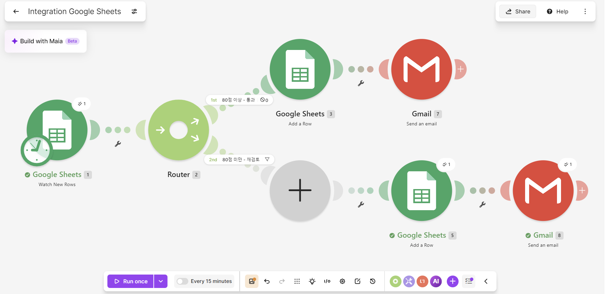

---

## 6.2 80점 이상 - 통과 경로

첫 번째 Route에는 다음 Filter를 적용하였다.

```text
점수 >= 80
```

조건을 만족하면 다음 Action이 실행된다.

1. `통과자` Worksheet에 데이터 추가
2. Gmail 통과 안내 메일 발송

85점의 테스트 데이터를 입력하여 해당 경로가 정상적으로 실행되는지 확인하였다.

### 통과자 시트 기록 결과

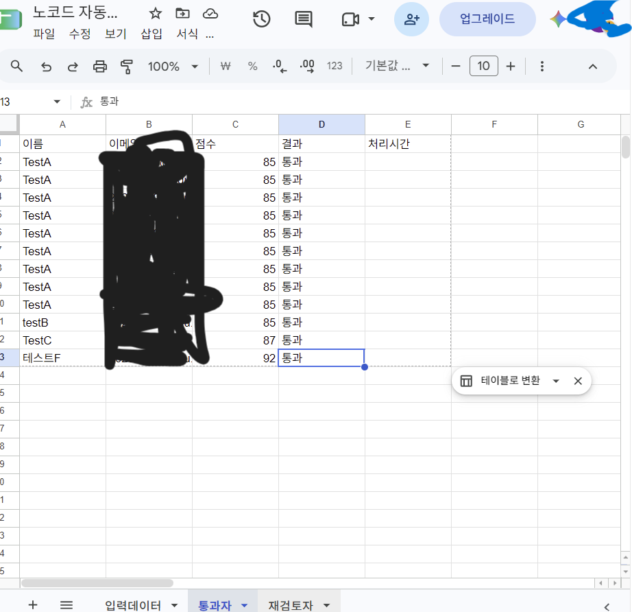

### 통과 이메일 발송 결과

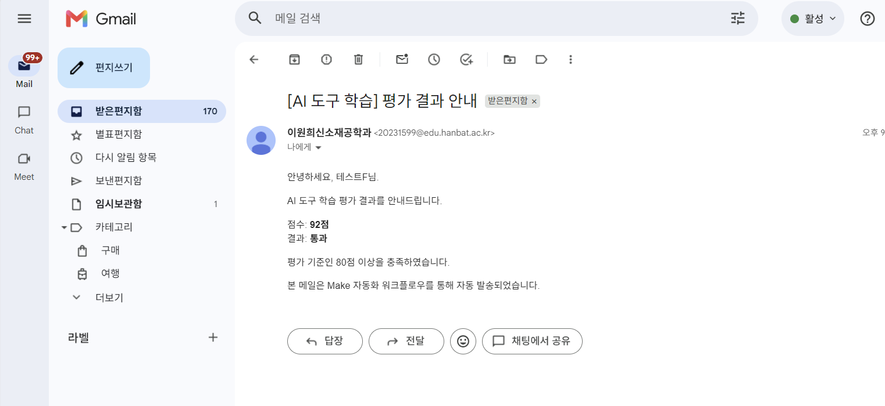

85점 데이터가 `통과자` 시트에 자동 기록되었으며,
입력된 이메일 주소로 통과 안내 메일이 자동 발송되는 것을 확인하였다.

---

## 6.3 80점 미만 - 재검토 경로

두 번째 Route에는 다음 Filter를 적용하였다.

```text
점수 < 80
```

조건을 만족하면 다음 Action이 실행된다.

1. `재검토자` Worksheet에 데이터 추가
2. Gmail 재검토 안내 메일 발송

65점의 테스트 데이터를 입력하여 해당 경로가 정상적으로 실행되는지 확인하였다.

### 재검토자 시트 기록 결과

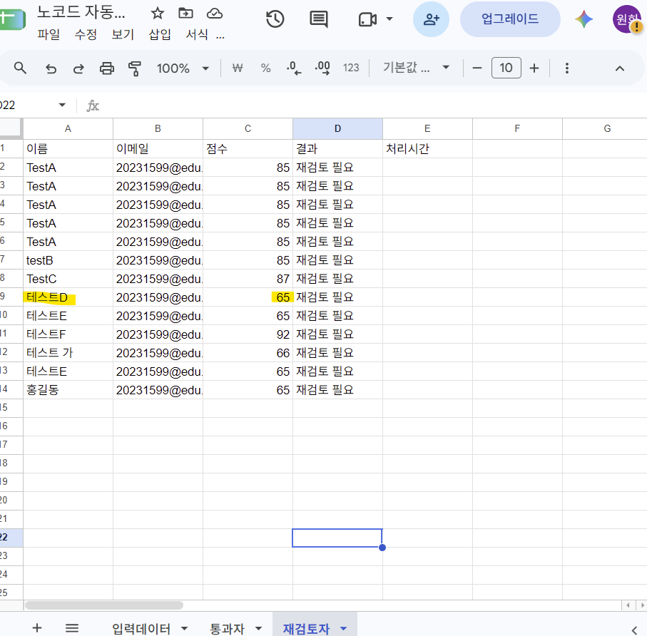

### 재검토 이메일 발송 결과

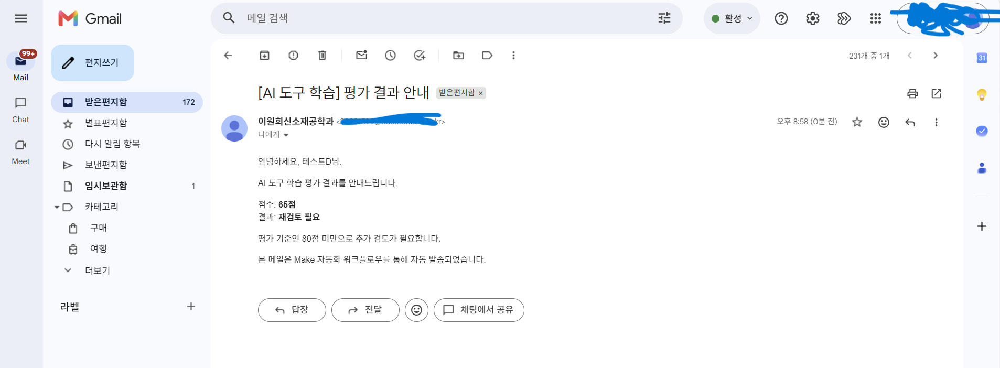

65점 데이터가 `재검토자` 시트에 자동 기록되었으며,
재검토 안내 이메일이 자동 발송되는 것을 확인하였다.

---

# 7. Zapier 구현

## 7.1 워크플로우 구성

Zapier에서는 Google Sheets의 `New Spreadsheet Row`를 Trigger로 사용하였다.

점수에 따른 조건 분기는 **Paths by Zapier**를 이용하여 구현하였다.

```text
Google Sheets - New Spreadsheet Row
                │
                ▼
              Paths
         ┌──────┴──────┐
         ▼             ▼
      Path A         Path B
      점수 ≥ 80      점수 < 80
         │             │
         ▼             ▼
  Google Sheets    Google Sheets
  Create Row       Create Row
         │             │
         ▼             ▼
       Gmail          Gmail
    Send Email      Send Email
```

### Zapier 전체 워크플로우

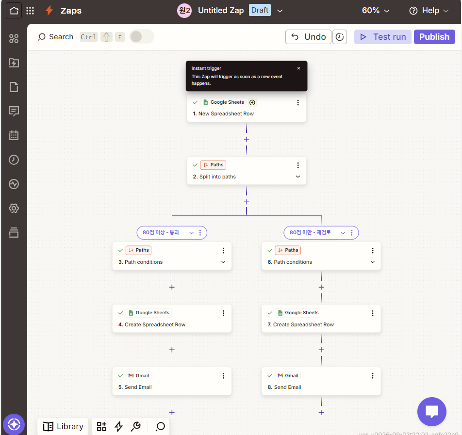

---

## 7.2 Path A - 80점 이상 통과

Path A의 조건은 다음과 같이 설정하였다.

```text
점수 >= 80
```

조건을 만족하면 다음 Action이 실행된다.

1. `통과자` Worksheet에 새로운 행 생성
2. Gmail 통과 안내 이메일 발송

85점 데이터를 입력하여 실제 자동 실행을 검증하였다.

### 통과자 시트 기록 결과

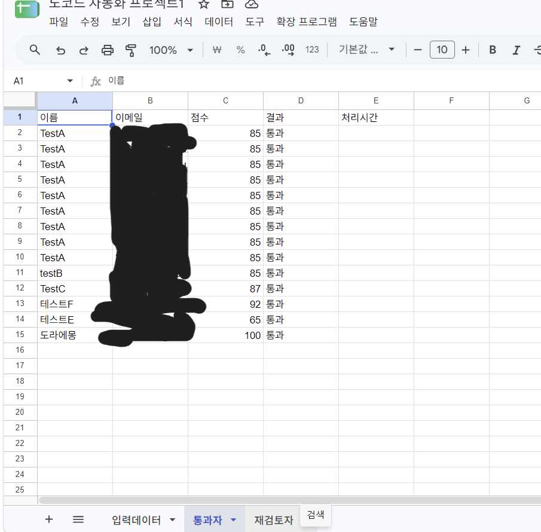

### 통과 이메일 발송 결과

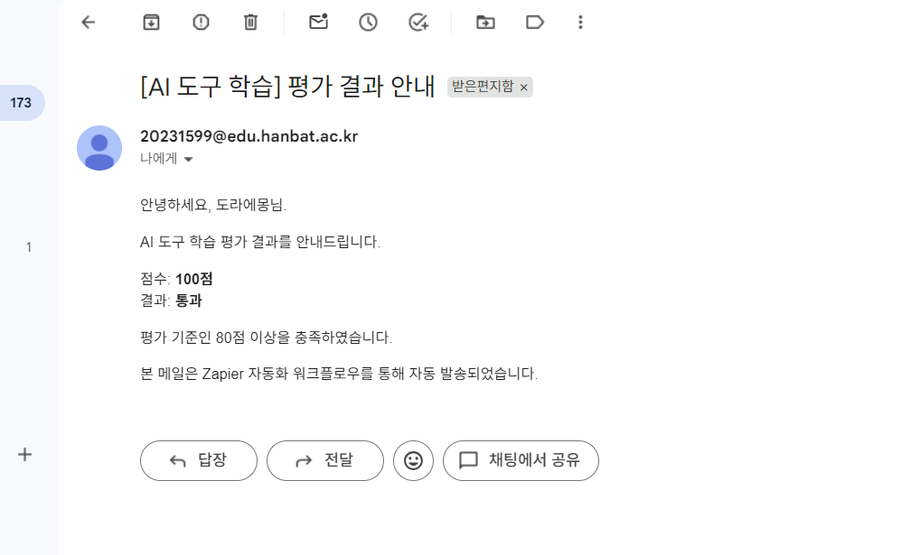

85점 데이터가 Path A로 분기되어 `통과자` 시트에 기록되고,
통과 안내 이메일이 자동 발송되는 것을 확인하였다.

---

## 7.3 Path B - 80점 미만 재검토

Path B의 조건은 다음과 같이 설정하였다.

```text
점수 < 80
```

조건을 만족하면 다음 Action이 실행된다.

1. `재검토자` Worksheet에 새로운 행 생성
2. Gmail 재검토 안내 이메일 발송

65점 데이터를 입력하여 실제 자동 실행을 검증하였다.

### 재검토자 시트 기록 결과

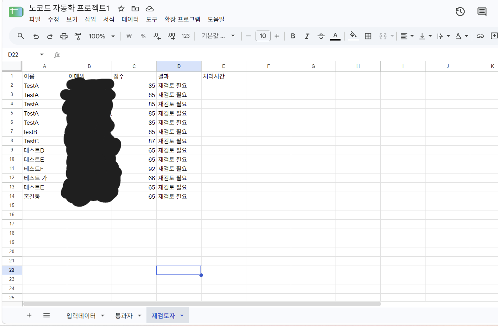

### 재검토 이메일 발송 결과

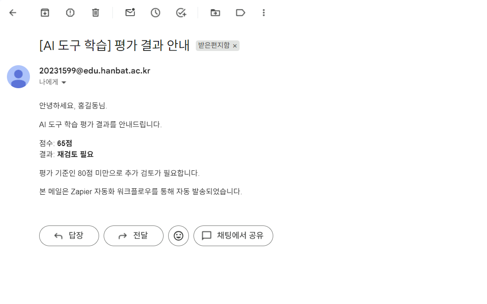

65점 데이터가 Path B로 분기되어 `재검토자` 시트에 기록되고,
재검토 안내 이메일이 자동 발송되는 것을 확인하였다.

---

# 8. 실행 결과 검증

두 개의 분기 경로가 모두 실제로 실행되는지 확인하기 위해 85점과 65점의 테스트 데이터를 사용하였다.

| 도구 | 테스트 점수 | 분기 결과 | Sheets 기록 | Gmail 발송 |
|---|---:|---|---|---|
| Make | 85 | 통과 | 정상 | 정상 |
| Make | 65 | 재검토 필요 | 정상 | 정상 |
| Zapier | 85 | 통과 | 정상 | 정상 |
| Zapier | 65 | 재검토 필요 | 정상 | 정상 |

따라서 Make와 Zapier 모두 두 개의 분기 경로가 정상적으로 작동하였으며,
Google Sheets 기록과 Gmail 자동 발송까지 정상적으로 수행되는 것을 확인하였다.

---

# 9. Make와 Zapier 비교

| 비교 항목 | Make | Zapier |
|---|---|---|
| UI/UX | 모듈과 연결선을 통해 전체 흐름을 한 화면에서 파악하기 쉬웠다. | Trigger와 Action이 단계별로 구성되어 작업 순서를 이해하기 쉬웠다. |
| 초기 사용 난이도 | Module, Router, Filter, Mapping 등의 개념을 익힐 필요가 있었다. | Trigger와 Action을 순차적으로 설정하는 방식으로 비교적 직관적이었다. |
| 조건 분기 | Router와 Filter를 이용하여 조건별 Route를 구성하였다. | Paths를 이용하여 조건별 Path를 구성하였다. |
| 데이터 Mapping | 모듈 사이에서 필요한 데이터를 직접 Mapping하였다. | 이전 Step의 데이터를 다음 Action에서 선택하여 연결하였다. |
| 워크플로우 시각화 | 여러 분기와 데이터 흐름을 전체적으로 확인하기 편리했다. | 각 Path별 실행 단계를 구분하여 확인하기 편리했다. |
| 테스트 방식 | `Run once` 후 실제 데이터를 입력하여 전체 실행 흐름을 확인하였다. | Step별 Test와 Publish 후 실제 데이터 입력을 통해 확인하였다. |
| 오류 확인 | 오류가 발생한 모듈에서 상세 오류 메시지를 확인할 수 있었다. | 문제가 발생한 Step을 개별적으로 확인하고 수정할 수 있었다. |

---

# 10. 도구별 장단점

## Make

### 장점

- 전체 자동화 흐름을 시각적으로 파악하기 쉽다.
- Router와 Filter를 이용하여 조건별 경로를 명확하게 구성할 수 있다.
- 각 모듈 사이에서 전달되는 데이터를 세부적으로 Mapping할 수 있다.
- 여러 단계와 분기가 포함된 워크플로우를 한 화면에서 확인하기 편리하다.

### 단점

- 처음 사용할 경우 Module, Router, Filter, Mapping 등의 개념을 익힐 필요가 있다.
- Mapping을 잘못 설정할 경우 원하는 데이터가 전달되지 않을 수 있다.
- 외부 서비스 인증 오류 발생 시 각 모듈의 Connection을 확인해야 한다.

## Zapier

### 장점

- Trigger와 Action을 단계별로 설정하여 각 과정의 역할을 이해하기 쉽다.
- Paths를 이용하여 조건별 실행 경로를 구성할 수 있다.
- 각 Step별 Test 기능을 이용하여 설정 상태를 확인하기 편리하다.
- 이전 단계의 데이터를 다음 단계에서 선택하여 연결하는 방식이 직관적이었다.

### 단점

- 분기와 Action이 증가하면 전체 Step 수도 증가한다.
- 설정 과정에서 표시되는 Sample Data와 실제 실행 데이터를 구분할 필요가 있다.
- 각 Path에 필요한 Action을 별도로 구성해야 한다.

---
# 11. 도구별 적합한 사용 상황

## Make가 적합한 상황

Make는 여러 조건과 서비스가 연결되고 데이터의 흐름을 시각적으로 확인해야 하는 복잡한 자동화에 적합하다. Router와 Filter를 이용하여 여러 실행 경로를 한 화면에서 구성할 수 있기 때문에 조건 분기가 많거나 여러 단계의 데이터 처리가 필요한 업무에 활용하기 좋다.

예를 들어 여러 조건에 따른 데이터 분류, 여러 서비스 간 데이터 전달, 복수의 분기를 포함하는 업무 자동화 등에 활용할 수 있다.

## Zapier가 적합한 상황

Zapier는 Trigger 이후 여러 Action을 순차적으로 실행하는 비교적 명확한 업무 자동화에 적합하다. 각 Step을 순서대로 설정하고 개별적으로 테스트할 수 있기 때문에 처음 자동화를 구성하거나 실행 단계를 하나씩 확인해야 하는 업무에 활용하기 편리하다.

예를 들어 새로운 데이터 입력에 따른 알림, 이메일 자동 발송, 데이터 기록 및 전달과 같이 실행 순서가 명확한 업무에 활용할 수 있다.

# 12. 구현 과정에서 발생한 문제와 해결

## 12.1 Make Gmail 수신자 Mapping 오류

Gmail Action 실행 과정에서 다음 오류가 발생하였다.

```text
Invalid email address in parameter 'to'.
```

Gmail의 `To` 항목에 이메일 데이터가 올바르게 Mapping되지 않아 발생한 문제였다.

Google Sheets Trigger의 `이메일` 필드를 Gmail의 `To` 항목에 직접 Mapping하여 해결하였다.

## 12.2 Make Gmail 인증 오류

Gmail Action 실행 과정에서 다음과 같은 인증 오류가 발생하였다.

```text
[401] Request is missing required authentication credential.
```

새로운 Gmail Connection을 생성하고 Google 계정의 OAuth 인증을 다시 진행하여 해결하였다.

## 12.3 Zapier Trigger 선택 오류

초기 설정 과정에서 `New Spreadsheet` Trigger를 선택하여
새로운 행 데이터가 아닌 Spreadsheet 자체의 정보가 출력되는 문제가 발생하였다.

Trigger를 `New Spreadsheet Row`로 변경하고 `입력데이터` Worksheet를 지정하여 해결하였다.

## 12.4 Zapier Sample Data

Path A를 설정할 때 Trigger의 Sample Data가 65점이었기 때문에
80점 이상 Path에서도 설정 화면에는 65점이 표시되었다.

이는 설정용 Sample Data이며 실제 조건 실행과는 별개임을 확인하였다.

Zap을 Publish한 후 새로운 85점과 65점 데이터를 각각 입력하여
실제 조건 분기가 정상적으로 수행되는 것을 확인하였다.

---

# 13. 결론

본 프로젝트에서는 동일한 평가 결과 자동 분류 및 이메일 통보 업무를
**Make와 Zapier에서 각각 구현**하였다.

두 도구 모두 다음 기능을 정상적으로 수행하였다.

- Google Sheets의 새로운 행 감지
- 점수 조건에 따른 자동 분기
- 통과자 또는 재검토자 시트 자동 기록
- Gmail 결과 안내 자동 발송
- 두 개의 분기 경로 실제 실행

Make에서는 **Router와 Filter**, Zapier에서는 **Paths**를 이용하여 분기를 구현하였다.

동일한 자동화 목적을 달성하더라도 자동화 도구에 따라 워크플로우를 구성하고
조건을 표현하는 방식에 차이가 있음을 확인하였다.

또한 실제 구현 과정에서 데이터 Mapping, 외부 서비스 인증,
Trigger 선택 및 Sample Data 확인이 자동화의 정상 동작에 중요한 요소임을 확인하였다.

---

# Project 2. 연구 논문·자료 자동 분류 및 중요 논문 알림 시스템

## 1. 반복 업무 정의

연구를 진행하면서 새로운 논문이나 연구자료를 발견할 때마다 논문의 제목, 키워드, 링크 등을 기록하고 연구 주제와의 관련성을 판단하는 작업이 반복적으로 발생한다.

특히 연구와 직접적으로 관련된 논문은 별도로 분류하여 관리해야 하며, 중요한 자료가 새롭게 등록되었는지 지속적으로 확인해야 하기 때문에 자료가 많아질수록 관리 과정이 번거로워질 수 있다.

따라서 Project 2에서는 Google Sheets에 새로운 논문 정보를 입력하면 Make가 새로운 데이터를 자동으로 감지하고, 관련도와 연구 핵심 키워드를 기준으로 중요 논문을 선별하도록 구성하였다.

조건을 만족한 논문은 별도의 `중요논문` Worksheet에 자동 저장되고 Gmail을 통해 중요 연구논문 등록 알림이 발송되도록 자동화하였다.

---

## 2. 프로젝트 목적

본 프로젝트의 목적은 반복적으로 수행되는 연구자료의 분류 및 확인 작업을 자동화하는 것이다.

기존에는 새로운 논문을 발견할 때마다 연구 관련성을 직접 확인하고 중요한 자료를 별도로 정리해야 했다.

이를 개선하기 위해 다음 과정을 자동화하였다.

1. 새로운 논문 정보 입력
2. 새로운 데이터 자동 감지
3. 관련도 및 연구 키워드 확인
4. 중요 연구논문 자동 분류
5. 중요논문 Worksheet 자동 저장
6. Gmail 알림 자동 발송

이를 통해 연구자료 관리 과정에서 발생하는 반복 작업을 줄이고 중요 연구자료를 보다 체계적으로 관리하고자 하였다.

---

## 3. 자동화 도구 선정 및 선정 이유

Project 2의 자동화 도구로 **Make**를 선택하였다.

Make는 Google Sheets와 Gmail을 하나의 Scenario에서 연결할 수 있으며, Module 사이에 Filter를 설정하여 특정 조건을 만족하는 데이터만 다음 Action으로 전달할 수 있다.

또한 자동화 과정이 시각적인 Workflow 형태로 표현되기 때문에 Trigger부터 Filter, 데이터 저장, 이메일 발송까지 전체 데이터 흐름을 직관적으로 확인할 수 있다는 장점이 있다.

본 프로젝트는 단순히 새로운 데이터를 감지하는 것뿐만 아니라 연구 관련도와 키워드를 동시에 확인해야 하므로, 조건을 시각적으로 설정할 수 있는 Make가 적합하다고 판단하였다.

### 사용 도구

| 구분 | 사용 도구 | 역할 |
|---|---|---|
| 논문 정보 입력 | Google Sheets | 새로운 논문 및 연구자료 입력 |
| 자동화 | Make | Trigger, Filter, Action 실행 |
| 중요 논문 저장 | Google Sheets | 조건을 만족한 논문 별도 저장 |
| 알림 | Gmail | 중요 연구논문 등록 알림 발송 |

---

## 4. Google Sheets 구성

Google Sheets 파일 `연구논문 자료관리 자동화`에 다음 두 개의 Worksheet를 구성하였다.

### 4.1 논문입력

새로운 논문 및 연구자료를 입력하는 Worksheet이다.

| 논문제목 | 키워드 | 링크 | 관련도 | 등록일 |
|---|---|---|---:|---|
| 논문 제목 | 연구 관련 키워드 | 논문 링크 | 1~5 | 등록 날짜 |

`관련도`는 연구 주제와의 연관성을 기준으로 1~5의 값으로 입력하도록 구성하였다.

### 논문입력 Worksheet

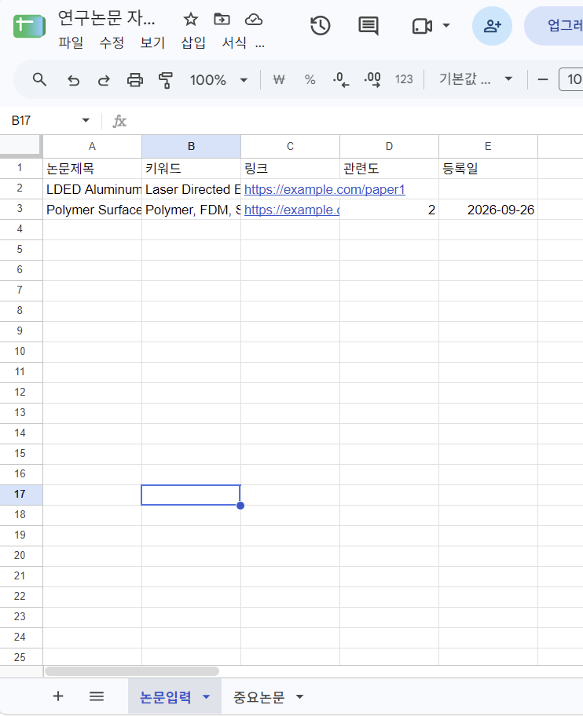

---

### 4.2 중요논문

Filter 조건을 만족한 논문을 별도로 관리하기 위한 Worksheet이다.

| 논문제목 | 키워드 | 링크 | 관련도 | 분류결과 | 처리일 |
|---|---|---|---:|---|---|

Filter를 통과한 자료의 논문제목, 키워드, 링크, 관련도를 자동으로 Mapping하고 `분류결과`에는 `중요 연구논문`이 입력되도록 설정하였다.

---

## 5. 전체 워크플로우 설계

전체 자동화 Workflow는 다음과 같이 설계하였다.

```text
Google Sheets
새로운 논문 정보 입력
        │
        ▼
Watch New Rows
    [Trigger]
        │
        ▼
중요 연구논문 Filter
        │
        │
   관련도 ≥ 4
       AND
연구 핵심 키워드 포함
        │
        ▼
Google Sheets
Add a Row
    [Action 1]
        │
        ▼
Gmail
Send an Email
    [Action 2]
```

### 전체 Make Workflow

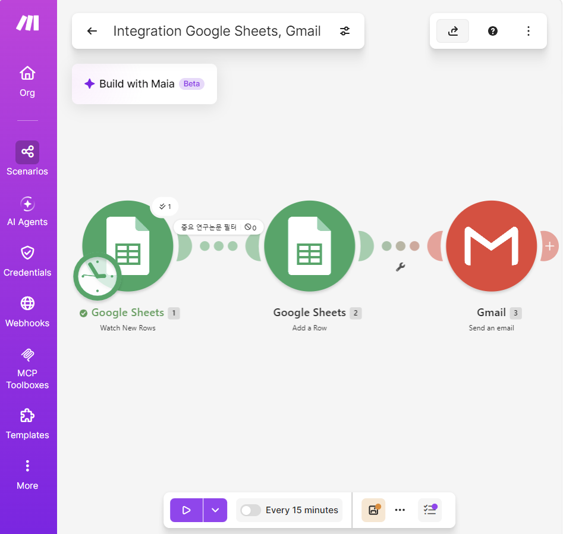

본 Workflow는 **Trigger 1개, Filter 1개, Action 2개**로 구성하였다.

---

## 6. Trigger 설정

Trigger는 Google Sheets의 **Watch New Rows** Module을 사용하였다.

Google Sheets의 `논문입력` Worksheet에 새로운 행이 추가되면 Make가 이를 감지하여 자동화 Workflow를 시작한다.

따라서 사용자는 새로운 연구자료를 `논문입력` Worksheet에 추가하는 것만으로 자동화 과정을 시작할 수 있다.

```text
Trigger
Google Sheets - Watch New Rows
```

---

## 7. Filter 설정

새롭게 입력된 모든 논문을 중요 논문으로 분류하지 않고, 연구 관련성이 높은 자료만 선별하기 위해 `중요 연구논문 필터`를 설정하였다.

Filter의 기본 조건은 다음과 같다.

```text
관련도 >= 4
AND
연구 핵심 키워드 중 하나 이상 포함
```

연구 핵심 키워드는 다음과 같이 설정하였다.

- Laser Directed Energy Deposition
- Gadolinium
- TiB2
- Neutron Absorption

따라서 전체 Filter 논리는 다음과 같다.

```text
관련도 >= 4

AND

(
Laser Directed Energy Deposition
OR
Gadolinium
OR
TiB2
OR
Neutron Absorption
)
```

즉, 관련도가 4 이상이면서 설정된 연구 핵심 키워드 중 하나 이상을 포함하는 자료만 중요 연구논문으로 분류되도록 구성하였다.

### Make Filter 설정

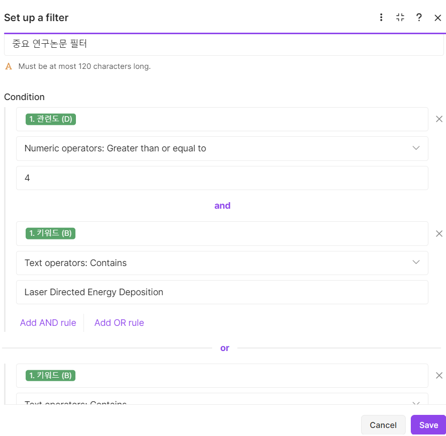

---

## 8. Action 구성

### 8.1 Action 1 - 중요논문 Worksheet 자동 저장

Filter를 통과한 논문의 정보를 Google Sheets의 `중요논문` Worksheet에 새로운 행으로 자동 저장하도록 설정하였다.

다음 데이터가 기존 `논문입력` Worksheet에서 자동으로 Mapping된다.

- 논문제목
- 키워드
- 링크
- 관련도

또한 `분류결과`에는 `중요 연구논문`이 자동으로 입력되도록 구성하였다.

```text
Action 1
Google Sheets - Add a Row
```

### 중요논문 Worksheet 실행 결과

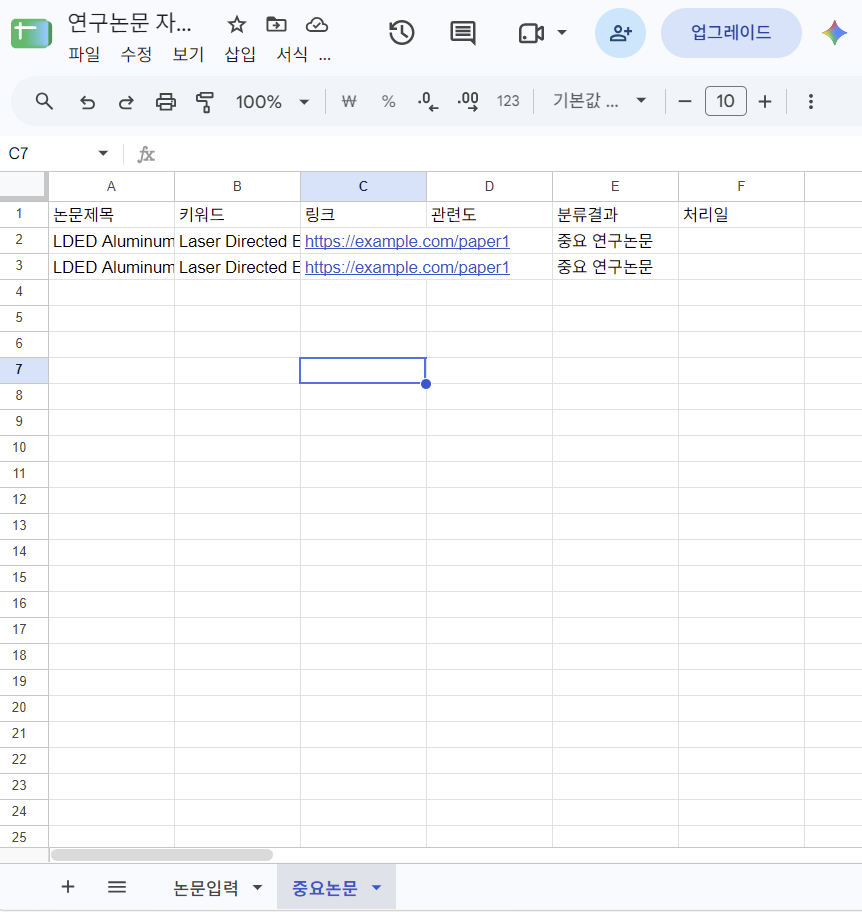

---

### 8.2 Action 2 - Gmail 중요 논문 알림

중요논문 Worksheet에 데이터가 저장된 후 Gmail의 **Send an Email** Action이 실행되도록 구성하였다.

이메일에는 다음 정보가 자동으로 포함되도록 설정하였다.

- 논문 제목
- 키워드
- 관련도
- 논문 링크

이메일 제목은 다음과 같이 설정하였다.

```text
[연구자료 자동화] 중요 연구논문이 등록되었습니다
```

이를 통해 사용자가 Google Sheets를 다시 확인하지 않더라도 중요 연구자료가 등록되었다는 사실을 이메일을 통해 확인할 수 있도록 하였다.

---

## 9. 실행 테스트

자동화가 설정한 조건에 따라 정상적으로 작동하는지 확인하기 위하여 두 가지 데이터를 이용해 테스트하였다.

### 9.1 중요 연구논문 - Filter 통과 테스트

연구 핵심 키워드를 포함하고 관련도가 5인 데이터를 `논문입력` Worksheet에 새롭게 추가하였다.

테스트 데이터에는 다음과 같은 연구 관련 키워드를 포함하였다.

```text
Gadolinium
TiB2
Neutron Absorption
```

관련도가 5이고 설정된 연구 핵심 키워드를 포함하기 때문에 Filter 조건을 만족하였다.

따라서 다음 두 Action이 순차적으로 실행되었다.

```text
Filter 통과
    ↓
중요논문 Worksheet 자동 저장
    ↓
Gmail 알림 자동 발송
```

실행 결과 `중요논문` Worksheet에 해당 논문 정보가 정상적으로 추가되었으며 Gmail 알림도 정상적으로 수신되었다.

### Gmail 알림 실행 결과

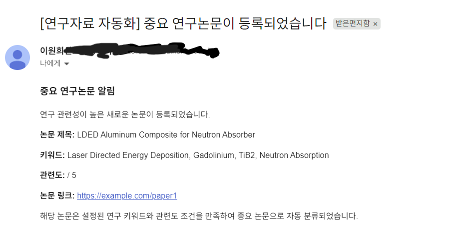

---

### 9.2 일반 연구자료 - Filter 차단 테스트

Filter가 조건을 만족하지 않는 자료를 정상적으로 차단하는지 확인하기 위한 테스트도 수행하였다.

다음과 같이 관련도가 낮고 설정된 연구 핵심 키워드를 포함하지 않는 자료를 입력하였다.

```text
논문제목:
Polymer Surface Treatment Study

키워드:
Polymer, FDM, Surface Treatment

관련도:
2
```

해당 데이터는 `관련도 ≥ 4` 조건을 만족하지 않으며 설정된 연구 핵심 키워드도 포함하지 않는다.

따라서 Filter에서 데이터가 차단되었으며 이후 Action은 실행되지 않았다.

```text
Watch New Rows
      ↓
Filter
      ↓
조건 불충족
      X
중요논문 저장 실행 안 됨
Gmail 발송 실행 안 됨
```

실제 실행 결과 `중요논문` Worksheet에 해당 자료가 추가되지 않았으며 Gmail 알림도 발송되지 않았다.

---

## 10. 실행 결과 검증

| 테스트 데이터 | 관련도 | 연구 키워드 | Filter 결과 | 중요논문 저장 | Gmail 알림 |
|---|---:|---|---|---|---|
| 중요 연구논문 | 5 | 포함 | 통과 | 정상 실행 | 정상 발송 |
| 일반 연구자료 | 2 | 미포함 | 차단 | 실행 안 됨 | 발송 안 됨 |

두 가지 조건을 실제로 테스트한 결과, 설정된 조건을 만족하는 자료와 만족하지 않는 자료가 정상적으로 구분되는 것을 확인하였다.

---

## 11. 자동화 적용 효과

기존에는 새로운 논문을 발견할 때마다 연구 관련성을 확인하고 중요한 논문을 별도로 정리하는 과정이 필요하였다.

본 자동화를 적용하면 사용자는 새로운 논문 정보를 `논문입력` Worksheet에 등록하기만 하면 된다.

이후 Make가 자동으로 데이터를 감지하고 설정된 조건을 확인하여 중요 연구논문만 별도의 Worksheet에 저장한다.

또한 중요 논문이 등록되면 Gmail 알림이 자동으로 발송되므로 중요한 연구자료의 등록 여부를 보다 빠르게 확인할 수 있다.

이를 통해 다음과 같은 반복 업무를 줄일 수 있다.

- 연구자료의 반복적인 확인
- 중요 논문의 수동 분류
- 별도 Worksheet로의 수동 복사
- 중요 자료 등록 여부의 반복적인 확인

---

## 12. 요구사항 충족 여부

| 과제 요구사항 | Project 2 구현 내용 |
|---|---|
| 반복 업무 정의 | 연구 논문 및 자료의 반복적인 분류·관리 |
| 자동화 도구 선정 | Make |
| 도구 선정 이유 설명 | Filter와 Google Sheets/Gmail 연동에 적합 |
| Trigger 1개 이상 | Google Sheets - Watch New Rows |
| Action 2개 이상 | Google Sheets - Add a Row / Gmail - Send an Email |
| Filter 또는 Router 1개 이상 | 중요 연구논문 Filter |
| Trigger에 따른 자동 실행 | 새로운 논문 행 추가 시 실행 |
| Workflow 설계 | Trigger → Filter → Sheets → Gmail |
| 구현 화면 | Make 전체 Workflow 및 Filter 화면 첨부 |
| 실행 화면 | 중요논문 Worksheet 및 Gmail 수신 결과 첨부 |
| 조건 검증 | Filter 통과 및 차단 테스트 완료 |

---

## 13. 결론

Project 2에서는 연구 과정에서 반복적으로 발생하는 논문 및 연구자료의 분류와 확인 작업을 자동화하기 위해 **연구 논문·자료 자동 분류 및 중요 논문 알림 시스템**을 구현하였다.

Google Sheets의 `논문입력` Worksheet에 새로운 연구자료가 등록되면 Make의 `Watch New Rows` Module이 이를 감지하고, 관련도와 연구 핵심 키워드를 기준으로 Filter를 적용하도록 구성하였다.

Filter 조건을 만족한 자료는 `중요논문` Worksheet에 자동으로 저장되고 Gmail을 통해 중요 연구논문 등록 알림이 발송된다. 반면 조건을 만족하지 않는 자료는 Filter 단계에서 차단되어 이후 Action이 실행되지 않는다.

실제 테스트를 통해 **조건을 만족한 자료의 자동 저장 및 Gmail 발송**과 **조건을 만족하지 않은 자료의 차단**이 모두 정상적으로 작동하는 것을 확인하였다.

이를 통해 반복적인 연구자료 관리 업무를 줄이고, 연구와 관련성이 높은 자료를 보다 체계적으로 관리할 수 있는 자동화 Workflow를 구현하였다.

# 추가 설계 및 운영 고려사항

## 1. 자동 실행 및 운영 확인

본 프로젝트의 워크플로우는 Trigger를 기준으로 새로운 데이터가 입력되었을 때 이후 단계가 자동으로 실행되도록 구성하였다.

Project 1에서는 Google Sheets에 새로운 평가 데이터가 입력되면 Trigger가 이를 감지하고 점수 조건에 따라 분기한 뒤 Google Sheets 기록과 Gmail 발송을 수행한다.

Project 2에서도 `논문입력` Worksheet에 새로운 행이 추가되면 Make의 `Watch New Rows` Trigger를 통해 Filter 및 이후 Action이 실행되도록 구성하였다.

실제 테스트에서는 새로운 데이터를 직접 추가하여 Trigger부터 최종 Action까지 정상적으로 실행되는 것을 확인하였다.

지속적인 운영 환경에서는 Make와 Zapier의 실행 History를 이용하여 실행 성공 여부와 오류 발생 여부를 주기적으로 확인할 수 있다. 또한 장기간 운영 시에는 실행 시간, 처리 데이터, 성공/실패 여부를 기준으로 실행 이력을 관리하는 방식을 적용할 수 있다.

※ 본 프로젝트에서는 실제 서비스 수준의 24시간 무중단 운영을 검증한 것이 아니라, Trigger 발생에 따른 자동 실행과 정상 동작 여부를 테스트하였다.

---
### 장기 운영 및 무중단 검증 계획

본 프로젝트에서는 과제 수행 기간 동안 Trigger 발생에 따른 자동 실행과 정상 동작 여부를 검증하였으며, 실제 24시간 장기 실행 테스트는 수행하지 않았다.

향후 실제 운영 환경에서 무중단성을 검증할 경우 다음과 같은 절차를 적용할 수 있다.

1. Make와 Zapier의 자동화 Workflow를 활성화한 상태로 24시간 이상 유지한다.
2. 일정 시간 간격으로 테스트 데이터를 입력하여 Trigger가 지속적으로 정상 감지되는지 확인한다.
3. 각 실행의 시작 시간, 종료 시간, 성공/실패 여부를 실행 History에서 확인한다.
4. 실행 실패가 발생한 경우 오류 발생 단계와 오류 메시지를 기록한다.
5. 외부 서비스의 일시적 오류가 발생한 경우 제한된 횟수의 재시도를 수행하도록 설계한다.
6. 반복 실패 시 관리자에게 이메일 등의 방법으로 오류를 알리고 수동 확인 대상으로 전환한다.
7. 서비스 또는 Connection 중단 후 복구되었을 때 다음 Trigger부터 Workflow가 다시 정상 실행되는지 확인한다.

장기 운영 시 확인할 주요 지표는 다음과 같이 설정할 수 있다.

| 모니터링 항목 | 확인 내용 |
|---|---|
| Trigger 감지 여부 | 신규 데이터가 정상적으로 감지되는지 확인 |
| 실행 성공 여부 | Workflow의 최종 Action까지 정상 실행되었는지 확인 |
| 실행 실패 횟수 | 일정 기간 동안 발생한 오류 횟수 확인 |
| 처리 지연 | Trigger 발생 후 최종 Action까지의 처리 시간 확인 |
| Connection 상태 | Google Sheets 및 Gmail 인증 연결 상태 확인 |
| 재실행 결과 | 일시적 오류 이후 정상 복구 여부 확인 |

이러한 실행 History와 모니터링 결과를 장기간 수집하면 자동화 Workflow의 지속적인 실행 안정성을 검증할 수 있다.

※ 위 내용은 실제 24시간 무중단 운영을 수행했다는 의미가 아니라, 실제 운영 환경으로 확장할 경우 적용할 검증 계획이다.

## 2. 보안 및 민감정보 관리

제출물 작성 시 API Key, Access Token, 비밀번호 등의 인증정보가 README에 직접 포함되지 않도록 하였다.

Google 및 Gmail 연동은 자동화 도구의 Connection/OAuth 인증 기능을 이용하였으며, 인증정보 자체를 README에 기록하지 않았다.

또한 공개 저장소에 업로드하는 실행 화면에서는 개인 이메일 주소와 계정정보 등 개인정보가 노출되지 않도록 확인하고, 필요한 경우 일부 값을 마스킹하여 관리한다.

향후 API 또는 Webhook 기반 서비스를 추가할 경우에도 API Key와 Token은 코드나 README에 직접 작성하지 않고 자동화 플랫폼의 Connection 또는 Secret 관리 기능을 이용하는 것을 원칙으로 한다.

---

## 3. 예외 데이터 처리 정책

현재 워크플로우는 정상적인 입력 데이터를 기준으로 구현하였다.

운영 과정에서 발생할 수 있는 예외 상황에 대해서는 다음과 같은 처리 정책을 적용할 수 있다.

| 예외 상황 | 처리 방안 |
|---|---|
| 필수 입력값 누락 | Filter를 이용하여 이후 Action 실행 차단 |
| 잘못된 이메일 형식 | Gmail Action 실행 전 데이터 검증 |
| 중복 데이터 입력 | 고유값 또는 기존 행 조회 후 중복 여부 확인 |
| 외부 서비스 인증 만료 | Connection 상태 확인 및 OAuth 재인증 |
| Sheets 기록 실패 | 실행 History에서 오류 확인 후 재실행 |
| Gmail 발송 실패 | 오류 로그 확인 후 Connection 및 수신자 값 확인 |

본 프로젝트 구현 과정에서도 Gmail 수신자 Mapping 오류와 OAuth 인증 오류가 발생하였으며, 오류 메시지를 확인하고 Mapping 수정 및 Connection 재인증을 통해 해결하였다.

---

## 4. 모니터링 및 실패 대응 설계

본 프로젝트에서는 기본 요구사항에 집중하여 자동 실패 알림 및 자동 재시도 기능은 실제 Workflow에 포함하지 않았다.

실제 운영 환경으로 확장할 경우 다음과 같은 실패 대응 구조를 적용할 수 있다.

```text
Workflow 실행
      │
      ▼
정상 실행 여부 확인
   ┌──┴──┐
   │     │
 성공   실패
   │     │
   ▼     ▼
종료   오류 로그 기록
          │
          ▼
      관리자 알림
          │
          ▼
       재시도
          │
      재실패 시
          ▼
   임시 저장소 기록
```

예를 들어 Google Sheets 기록 또는 Gmail 발송이 실패하면 오류 내용을 별도의 오류 관리 Worksheet에 기록하고 관리자 이메일로 실패 알림을 전달하는 방식으로 확장할 수 있다.

재시도 정책은 일시적인 네트워크 또는 외부 서비스 오류를 고려하여 제한된 횟수만 재실행하고, 반복 실패 시 자동 반복을 중단한 뒤 수동 확인 대상으로 전환하는 방식으로 설계할 수 있다.

---

## 5. 비용 및 확장성 고려

본 프로젝트에서는 Google Sheets와 Gmail을 중심으로 비교적 단순한 규모의 자동화를 구성하였다.

Make는 Module과 Router를 이용하여 전체 데이터 흐름과 여러 조건을 시각적으로 구성하기 편리하므로 분기와 처리 단계가 증가하는 워크플로우를 설계할 때 활용하기 좋다.

Zapier는 Trigger와 Action을 단계별로 구성하기 때문에 비교적 단순하고 순차적인 업무를 빠르게 구성하고 관리하는 데 활용하기 편리하다.

다만 자동화 실행량이 증가하면 각 플랫폼의 플랜별 실행량 및 기능 제한이 실제 운영 비용에 영향을 줄 수 있다. 따라서 대량 데이터를 처리하는 환경에서는 예상 실행 횟수, Action 수, 필요한 기능을 확인하여 적절한 도구와 요금제를 선택할 필요가 있다.

또한 여러 사용자가 하나의 자동화를 관리하는 환경에서는 Workflow의 이름, 각 단계의 역할, 입력 및 출력 데이터 형식을 명확하게 문서화하여 유지보수성을 높일 필요가 있다.

※ 본 프로젝트에서는 유료 기능 사용 여부 및 구체적인 요금제별 한도를 비교 대상으로 검증하지 않았으므로 특정 비용이나 실행량 수치를 제시하지 않았다.

---

## 6. 워크플로우 모듈화 및 재사용 방안

자동화 규모가 커질 경우 모든 기능을 하나의 Workflow에 계속 추가하면 구조가 복잡해지고 유지보수가 어려워질 수 있다.

따라서 반복적으로 사용하는 기능을 기능 단위로 분리하여 재사용하는 구조를 고려할 수 있다.

예를 들어 다음과 같이 구분할 수 있다.

```text
[입력 처리]
데이터 수집 및 형식 확인
        │
        ▼
[조건 판별]
점수 또는 키워드 기준 분류
        │
        ▼
[데이터 저장]
Google Sheets 기록
        │
        ▼
[알림 처리]
Gmail 또는 메신저 알림
```

각 기능의 이름을 `Input`, `Filter`, `Storage`, `Notification`과 같이 역할 중심으로 통일하고, 모듈 사이에서 전달되는 데이터의 필드명과 형식을 일정하게 유지하면 다른 자동화에서도 동일한 구조를 재사용하기 쉽다.

예를 들어 Project 1의 Gmail 알림 구조와 Project 2의 Gmail 알림 구조를 공통적인 `Notification` 기능으로 설계하면 향후 유사한 자동화에서 동일한 알림 구조를 재사용할 수 있다.

---

## 7. 코드 및 외부 서비스 연계 확장 방안

노코드 자동화는 빠르게 Workflow를 구성할 수 있다는 장점이 있지만 데이터 처리 로직이 복잡해지거나 외부 시스템과의 연동이 필요한 경우 기본 Module만으로 구현하기 어려울 수 있다.

이 경우 다음과 같은 방식으로 확장할 수 있다.

- Webhook을 이용한 외부 서비스와의 데이터 송수신
- API를 이용한 외부 데이터 조회 및 저장
- 스크립트 또는 Custom Function을 이용한 복잡한 데이터 가공
- 생성형 AI API를 이용한 논문 요약 및 자동 분류
- 데이터베이스 연계를 통한 대량 데이터 관리

특히 Project 2는 향후 생성형 AI를 연동하여 다음과 같이 확장할 수 있다.

```text
논문 등록
   ↓
Trigger
   ↓
논문 정보 또는 초록 전달
   ↓
생성형 AI
요약 및 연구 관련성 분석
   ↓
Filter
   ↓
중요논문 저장
   ↓
Gmail 알림
```

현재 Project 2에서는 사용자가 입력한 관련도와 키워드를 기준으로 중요 논문을 분류하지만, 향후 생성형 AI를 연동하면 논문의 제목이나 초록을 분석하여 요약문을 생성하고 연구 관련성을 자동으로 판단하는 구조로 확장할 수 있다.

본 프로젝트에서는 이러한 코드 및 AI 연동 기능을 실제 구현 범위에는 포함하지 않았으며, 노코드 Workflow의 확장 방안으로 설계하였다.
